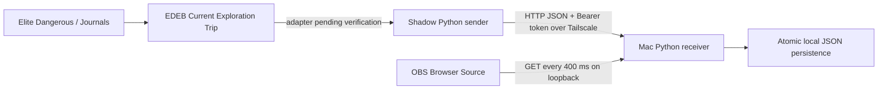

# Architecture



The sender initiates every network connection. The receiver never contacts Shadow. One shared Python package avoids duplication; no package installation or third-party runtime dependencies are required beyond Python 3.11+. The standard-library HTTP server is intended for this small private-tailnet workload, not public hosting.

## Protocol

`POST /api/value` requires `Authorization: Bearer <shared-token>` and `Content-Type: application/json`:

```json
{"value":12847563420,"timestamp":"2026-09-06T12:00:00+00:00","source":"edeb-current-trip"}
```

The server rejects booleans, strings, fractional/negative values, malformed timestamps, missing timezones and unknown sources. Values must be integers up to 9,007,199,254,740,991 (JavaScript's exact-integer limit), comfortably beyond hundreds of billions. A body is limited to 4 KiB. Responses: 200 acknowledged, 400 invalid, 401 token incorrect, 404 route absent, 503 persistence failed. Demo updates are accepted only by a receiver started with `--demo`.

`GET /api/value` returns the last accepted value/source/timestamp. Before any update those fields are `null`, never a fabricated zero. `GET /api/config` returns only visual configuration, without token/network settings. `GET /health` reports process availability, not EDEB freshness. `/overlay/` serves a fixed allowlist of local assets. No CORS permission is granted.

One sender and one commander are supported. The timestamp is an observation timestamp, not a trip identifier or an anti-replay sequence. Authenticated updates are accepted in arrival order, including decreases. Do not run competing senders or post manual values to production. Read endpoints are accessible to permitted tailnet peers; restrict tailnet policy to your machines if necessary.

## Network and reliability

Default port: 8765, configurable. One listener binds `127.0.0.1`, another binds the configured `tailscale_ip` (IPv4 in `100.64.0.0/10`). Wildcard/LAN/public listener addresses are rejected. Tailscale must already be active when the receiver binds its IP. The sender resolves MagicDNS or an IP to IPv4, validates every returned address as loopback/Tailscale and connects directly to the validated address. It ignores HTTP proxy environment settings and does not follow redirects. IPv6-only destinations are currently unsupported.

The real reader is deliberately disabled until verified. Once implemented, successful reads are polled every 0.5 seconds. Only values differing from the last acknowledged value are sent; the first read after sender startup is always sent, even for an old expedition. Errors cause retries after 2, 4, 8, 16, then 30 seconds. Latest observations supersede failed older updates. On successful acknowledgement backoff resets. No periodic POST heartbeat or queue of obsolete totals is maintained. A Mac restart preserves its state; if that state is manually removed while the sender stays running at an unchanged value, restart the sender to republish it.

The receiver serializes state updates under a lock, writes a temporary file, flushes/fsyncs it, then atomically replaces the state file before returning 200. This protects against ordinary process restarts and partial writes. It is not a backup guarantee against disk loss. An unreadable/corrupt state file stops startup explicitly rather than showing zero. State paths are relative to the configuration file. Demo state uses the `.demo` suffix. Do not run multiple receiver processes against the same state file.

OBS polls sequentially every 400 ms, with a three-second timeout. No overlapping requests or permanent animation. During receiver disconnection it retains its displayed number and reports unavailability. With no POST heartbeat it cannot distinguish a stationary trip from a stopped sender/EDEB: a stale timestamp alone is not an error. Check the sender and EDEB before streaming.

## Visual behavior

First value: direct display. Increase: independent vertical reels, 1.1 seconds by default. New values cancel any ongoing animation and target the latest total. Decrease/reset: direct display. Reduced motion: no animation. Local system fonts, transparent background, no sound. Text scales down if wider than the Browser Source; increase source dimensions/font size for legibility. Credits are always integral; `decimals` adds cosmetic trailing zeros only, never estimated fractions.

## Configuration reference

Install scripts create `config.local.json` only if absent, with a random token. Never commit it. Copy the same token privately to the other machine. Restart services and refresh OBS after changes.

| Key | Default / use |
| --- | --- |
| `token` | Generated secret, at least 32 ASCII characters |
| `port` | 8765; integer 1024–65535; receiver listening port |
| `tailscale_ip` | Empty for local demo; Mac's actual Tailscale IPv4 for remote use |
| `receiver_url` | `http://127.0.0.1:8765`; on Shadow use Mac MagicDNS/IP and matching port |
| `state_file` | `data/last-value.json`; relative to config file |
| `read_interval` | 0.5 seconds; range 0.1–60 |
| `overlay.label` | EXPLORATION VALUE |
| `overlay.suffix` | Cr |
| `overlay.font_size` | 64 pixels; 12–200 |
| `overlay.font_family` | Menlo, Consolas, monospace |
| `overlay.animation_ms` | 1100; 0–5000 |
| `overlay.decimals` | 0; integers 0–2, trailing zeros only |
| `overlay.thousands_separator` | Space |
| `overlay.poll_ms` | 400; 250–5000 |

`port` and the port in `receiver_url` must be changed together where relevant. Expected sub-second propagation applies to default healthy polling, independently of the visible animation's duration.
